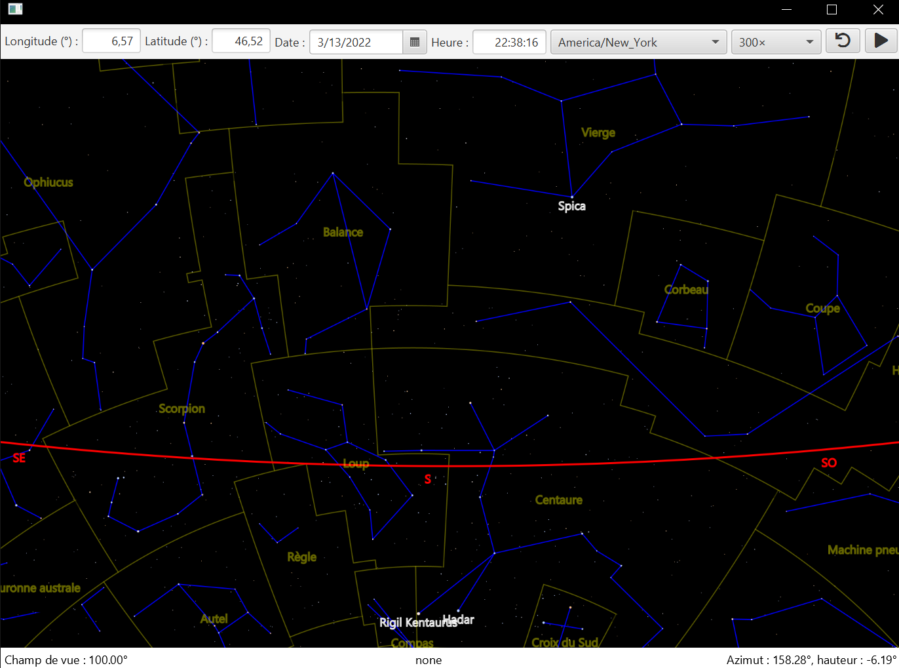

# Rigel
Java software that I implemented during the academic course 
CS108 at EPFL.

The positions of stars and asterisms are
computed for a given position and a given time.
I also implemented the bounds and positions of
all the constellations (in yellow).

 
https://cs108.epfl.ch/